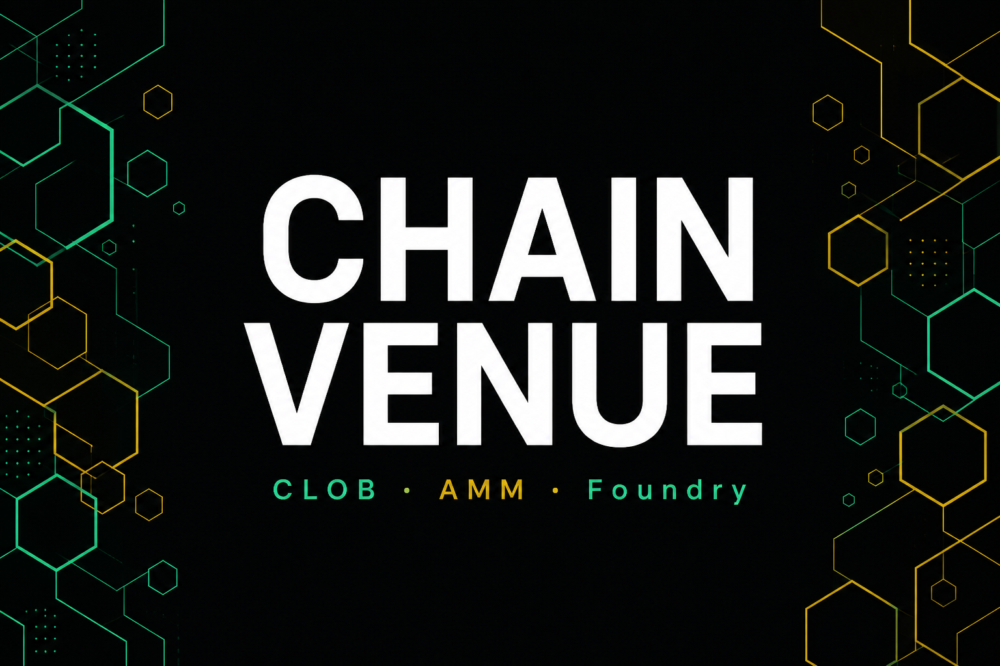

# ChainVenue

[](https://github.com/Wojtek-06/ChainVenue/actions/workflows/ci.yml)



**Cross-venue CLOB–AMM laboratory** — Foundry-tested EVM mechanics, a constant-product AMM, and a guarded hedge path that compares an off-chain book mid to on-chain pool spot. Built as a **portfolio lab demo** (Anvil / fork only): show economics and operational risk controls, not live MEV.

> Placement pitch: *I understand CLOB vs AMM economics and can ship Foundry-tested contracts with operational risk controls—on Anvil/fork only, not extractive live MEV.*

**Repo:** [github.com/Wojtek-06/ChainVenue](https://github.com/Wojtek-06/ChainVenue)  
**Safety:** local Anvil / fork / throwaway testnet only. No mainnet deploys with real funds. See [`docs/SAFETY.md`](docs/SAFETY.md) and [`docs/ANVIL.md`](docs/ANVIL.md).

---

## What this is (and isn’t)

| In scope (shipped) | Intentionally out of scope |
|--------------------|----------------------------|
| EVM lab (storage, memory, calls, reentrancy) | Public mainnet with real funds |
| CPAMM + Python differential / IL / two-pool arb search | Extractive live MEV against real users |
| `ClobVenueStub` push feed + QuantForge-shaped JSON mids | Live QuantForge snapshot daemon / rewriting a LOB in Solidity |
| Guarded `CrossVenueAdapter` hedge executor | Absorbing other products into this repo |
| Kill switch, sandwich / FoT / oracle / inclusion–reorg sims | Production custody, audits, or AgentGrid |
| Offline + Anvil E2E demo + metrics dashboard | |

CLOB mids come from **synthetic or JSON** snapshots with the same field shape as [QuantForge](https://github.com/Wojtek-06/QuantForge) (sibling LOB MM). Native QuantForge import is optional and never required.

---

## Architecture

```
┌─────────────────────┐     BookSnapshot (mid / inventory / ts)   ┌──────────────────────┐
│ ClobVenueStub       │◄──────────────────────────────────────────┤ Quote engine (Python)│
│ IClobVenue          │     synth / JSON / optional QF metrics    │ decide_hedge + cast  │
└─────────┬───────────┘                                           └──────────┬───────────┘
          │ latestSnapshot / isFresh                                          │
          ▼                                                                   │
┌─────────────────────┐     proposeHedge (guards)                             │
│ CrossVenueAdapter   │◄──────────────────────────────────────────────────────┘
│ + KillSwitch        │──── swapExactIn ────► ConstantProductAMM
└─────────────────────┘                         ▲
          ▲                                     │
   EVM lab + adversarial tests            AtomicArbExecutor / SpotOracle (sandbox)
```

| Layer | Role |
|-------|------|
| `src/lab/` | EVM stack / memory / storage / calldata + call-types + reentrancy demos |
| `src/amm/ConstantProductAMM.sol` | CPAMM: LP mint/burn, swap, fees |
| `src/tokens/` | Mock ERC-20 + fee-on-transfer token for adversarial tests |
| `src/adapters/` | CLOB stub, kill switch, **guarded hedge executor** |
| `src/exec/` · `src/oracle/` | Two-pool arb executor + owner-settable spot oracle (trust assumptions) |
| `python/reference/` | CPAMM math, IL, two-pool arb; vectors for Forge differential tests |
| `python/bridge/` | Quote engine (basis / sizing) + Cast snapshot helpers |
| `python/demo/e2e_hedge.py` | Offline sim, Anvil runner, feed, metrics ledger |
| `test/` | Unit, fuzz, invariant, lab, adapter, differential, adversarial, ops |
| `script/` | `DeployLab`, `DeployAMM`, `DemoHedge` (Anvil) |
| `web/dashboard/` | Static hedge metrics view over `metrics_ledger.json` |

Languages: **Solidity 0.8.28 + Foundry** (Forge / Cast / Anvil); **Python 3.10+** for the reference model and bridge.

---

## Prerequisites

- [Foundry](https://book.getfoundry.sh/getting-started/installation) (`forge`, `cast`, `anvil`) on `PATH`
- Python 3.10+
- Git submodules (`lib/forge-std`)

```bash
git submodule update --init --recursive
```

---

## Build & test

```bash
forge fmt --check
forge build
forge test -vv

# Gas report on hot paths
forge test --gas-report

# Python reference + quote engine + E2E sim
python -m pip install -r python/requirements.txt
cd python && python cpamm/generate_vectors.py && python -m pytest -q && cd ..
```

CI ([`.github/workflows/ci.yml`](.github/workflows/ci.yml)) runs Foundry `fmt` / `build` / `test` and Python pytest on Ubuntu.

---

## Quick demo (misprice → hedge → P&L)

```bash
# Offline economics (no chain; CI-safe)
cd python
python demo/e2e_hedge.py sim --mid 0.95 --no-native

# Metrics ledger → open web/dashboard/index.html
python demo/e2e_hedge.py ledger --out ../web/dashboard/metrics_ledger.json --no-native

# Anvil end-to-end (terminal A: anvil)
anvil
# terminal B:
forge script script/DemoHedge.s.sol:DemoHedgeScript --rpc-url http://127.0.0.1:8545 --broadcast -vv
# or: python demo/e2e_hedge.py anvil
```

More detail: [`docs/ANVIL.md`](docs/ANVIL.md) · EVM notes: [`docs/EVM_LAB.md`](docs/EVM_LAB.md) · QuantForge feed shape: [`docs/QUANTFORGE_INTEGRATION.md`](docs/QUANTFORGE_INTEGRATION.md) · Interview evidence: [`docs/EVIDENCE_PACK.md`](docs/EVIDENCE_PACK.md).

---

## Status (lab demo complete)

| Area | Status |
|------|--------|
| EVM / Foundry laboratory | Done |
| CPAMM + Python differential | Done |
| Cross-venue MM + hedge | Guarded executor + quote engine + offline & Anvil E2E |
| AMM sandbox | IL sim, two-pool arb search + `AtomicArbExecutor`, `SpotOracle` lab |
| Security & ops | Kill switch; sandwich / FoT / oracle / inclusion–reorg tests; invariants; threat model |
| Evidence pack | CI + docs + metrics dashboard (screen recording is optional / user-owned) |

Docs: [`docs/THREAT_MODEL.md`](docs/THREAT_MODEL.md) · [`docs/LATENCY_FEE_REGIMES.md`](docs/LATENCY_FEE_REGIMES.md) · [`docs/AMM_SANDBOX.md`](docs/AMM_SANDBOX.md).

---

## Honest limitations

- **CLOB feed is push-based** (`ClobVenueStub` / JSON). There is no live order-book daemon in this repo.
- **Gas / inclusion numbers are lab estimates**, not mempool truth.
- **`SpotOracle` is owner-settable by design** — to demonstrate trust assumptions, not as a production oracle.
- **Forks are optional analysis**; demos are Anvil-first.

---

## Sibling projects

- **QuantForge** — C++ LOB MM / backtester ([repo](https://github.com/Wojtek-06/QuantForge)); ChainVenue consumes the same mid/inventory shape via synth/JSON
- **AgentGrid** — separate later dogfood target; not started from this repo
